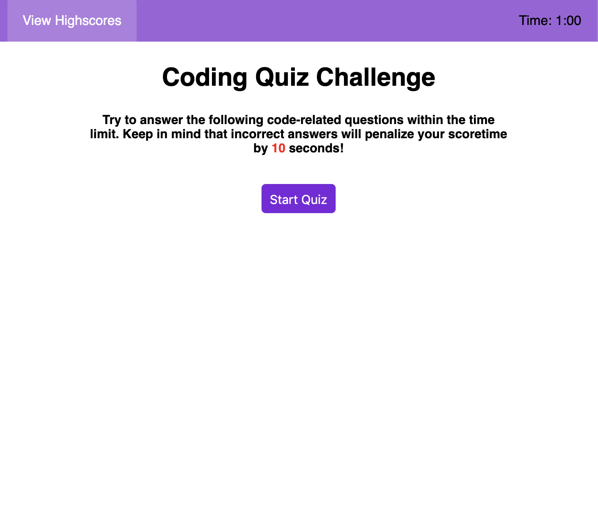

# WebApi
LIVE LINK: https://karanius.github.io/WebApi/
This project will be a timer-based quiz application that stores high scores within the Localstorage.

I tried to work on the UI in a more professional manner. I made it very complex at firs, but later on decided on simplifying it for a better user experience.

As extra, I added color to the timer. When answered wrong, it will turn red for 1 second, and deducts 10 seconds. when quiz is done, time freezes and turn blue.

